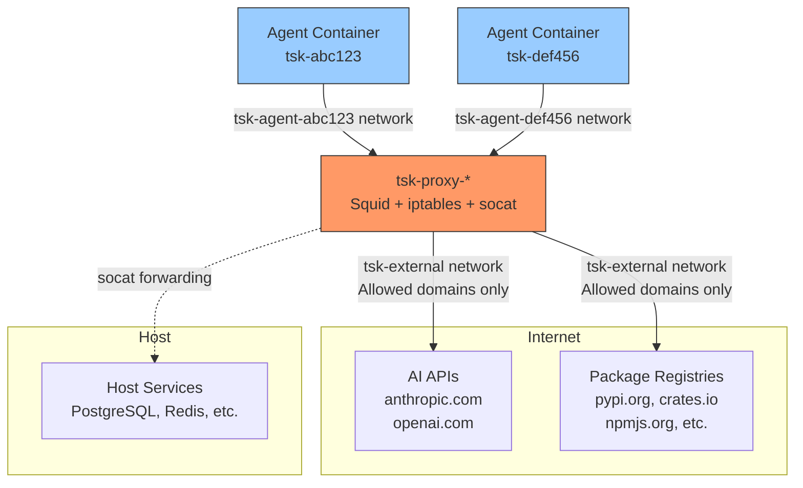
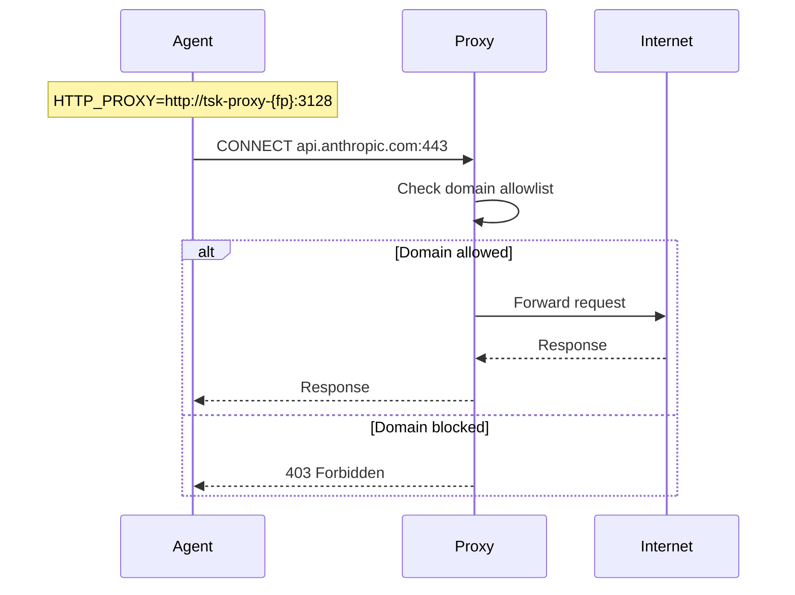

# Network Isolation in `tsk`

`tsk` uses a multi-layered network isolation strategy to ensure AI agents can only access approved external services. This document explains how the network architecture works and the security properties it provides.

## Architecture Overview



## Key Components

### Per-Agent Isolated Networks

Each agent container runs in its own Docker network created with the `internal: true` flag. Internal networks have no external gateway, meaning containers on them physically cannot route to the internet.

- **Network naming**: `tsk-agent-{task-id}`
- **Lifecycle**: Created when task starts, destroyed when task completes
- **Isolation**: Each agent is on a separate network, agents cannot communicate with each other

### Proxy Container (tsk-proxy-{fingerprint})

The proxy container is the sole gateway between agent networks and the outside world. Each unique proxy configuration (host_ports + squid.conf) gets its own proxy container identified by a fingerprint. A proxy connects to:
1. The `tsk-external-{fingerprint}` network (has internet access)
2. Each active agent's isolated network (joined on-demand)

The proxy runs:
- **Squid**: HTTP/HTTPS proxy with domain allowlist
- **socat**: TCP port forwarder for host service access
- **iptables**: Firewall rules for defense-in-depth (Docker only; unavailable in rootless Podman)

### Connection Flow



## Security Layers

`tsk` implements defense-in-depth with multiple independent security boundaries:

| Layer           | Mechanism                  | What It Prevents                     |
|-----------------|----------------------------|--------------------------------------|
| **Network**     | Docker internal networks   | Direct external connections          |
| **Firewall**    | iptables in proxy          | Non-proxy traffic to proxy container |
| **Application** | Squid domain allowlist     | Access to non-approved domains       |
| **Capability**  | Dropped NET_RAW, NET_ADMIN | Raw sockets, firewall changes        |
| **DNS**         | No direct resolver access  | DNS-based exfiltration               |

### Domain Allowlist

The Squid proxy allows access to:

- **AI APIs**: api.anthropic.com, api.openai.com, sentry.io, statsig.com
- **Python**: pypi.org, files.pythonhosted.org
- **Rust**: crates.io, index.crates.io, static.crates.io
- **Go**: proxy.golang.org, sum.golang.org, pkg.go.dev
- **Java**: repo.maven.apache.org, plugins.gradle.org
- **Node.js**: registry.npmjs.org, nodejs.org

Custom proxy configuration can be placed at `~/.config/tsk/squid.conf`.

### Host Service Access

The proxy can forward TCP connections to services running on the host machine. Configure in `tsk.toml`:

```toml
[defaults]
host_ports = [5432, 6379, 3000]  # PostgreSQL, Redis, dev server
```

Agents connect to `$TSK_PROXY_HOST:<port>` and traffic is forwarded to `host.docker.internal:<port>`.

### Agent Container Hardening

Agent containers run with dropped capabilities:

- `NET_ADMIN` - Cannot modify network configuration
- `NET_RAW` - Cannot create raw sockets (blocks ping, packet sniffing)
- `SYS_ADMIN` - Cannot mount filesystems or perform namespace operations
- `SYS_PTRACE` - Cannot trace other processes

## Why Internal Networks Over iptables?

`tsk` uses Docker internal networks rather than iptables rules in agent containers because:

1. **Secure by construction**: No route to external networks exists, rather than relying on firewall rules to block it
2. **No capability grants needed**: Agents don't need `CAP_NET_ADMIN` to set up firewall rules
3. **Bypass-resistant**: Even root in the container cannot create a route that doesn't exist
4. **DNS isolation for free**: No direct resolver access is possible
5. **Simpler failure mode**: If something goes wrong, agents have no connectivity rather than full connectivity
6. **Independent of image contents**: Custom project Dockerfiles cannot weaken isolation since it's a property of the network topology, not container configuration

## Disabling Network Isolation

Network isolation can be disabled on a per-task basis using the `--no-network-isolation` flag. When disabled, the container runs on the default Docker network with direct internet access, bypassing the proxy and isolated network setup entirely.

```bash
# Run a task without network isolation
tsk run --no-network-isolation -p "Install dependencies requiring custom registry"

# Add a queued task without network isolation
tsk add --no-network-isolation -p "Task needing unrestricted network access"

# Launch an interactive shell without network isolation
tsk shell --no-network-isolation
```

When network isolation is disabled:
- No proxy container is started or used
- No isolated Docker network is created
- The container has direct internet access (default Docker networking)
- `HTTP_PROXY` / `HTTPS_PROXY` environment variables are not set
- The `NET_RAW` capability is not dropped (tools like `ping` will work)
- All other security hardening (dropped capabilities like `NET_ADMIN`, `SYS_ADMIN`, etc.) remains in effect

Use this flag when tasks require network access patterns that are incompatible with the proxy-based filtering, such as custom package registries, proprietary APIs not on the allowlist, or debugging network connectivity issues.

## Tailscale Access

Tailscale support is opt-in via `--tailscale` or `tailscale = true` in `tsk.toml`. The sandbox joins your tailnet so agents can reach private services.

```bash
export TS_AUTHKEY="tskey-auth-..."   # reusable, ephemeral, tagged key (mint once)
tsk run --tailscale -p "Reproduce the bug against the staging database"
```

> **The trust boundary moves.** For non-tailnet traffic the Squid allowlist and the internal no-gateway topology stay exactly as described above. But **tailnet-bound traffic does not go through Squid** — it is governed entirely by your **Tailscale ACLs** and the auth key's tags. Enabling Tailscale therefore shifts egress control for tailnet destinations from tsk/Squid to Tailscale. Because the untrusted agent holds `NET_ADMIN` and can talk to `tailscaled`, tsk's config choices below are the *initial* posture, not an enforced boundary against a malicious agent — **the enforced boundary is your ACLs + a tagged, ephemeral auth key.**

What changes when Tailscale is enabled:

| Aspect            | Change                                                                        |
|-------------------|-------------------------------------------------------------------------------|
| **Proxy ACLs**    | `.tailscale.com` / `.tailscale.io` on port 443 are allowed (tight `dstdomain` suffix match) so `tailscaled` can reach the control plane and DERP relays. Everything else still follows the allowlist. |
| **Proxy instance**| Tailscale tasks get their own `tsk-proxy-{fingerprint}` container, since their Squid configuration differs. |
| **Capabilities**  | `NET_ADMIN` is granted (not dropped) so `tailscaled` can configure its interface and routes. All other dropped capabilities are unchanged. |
| **Devices / mode**| Linux + Docker gets a real `/dev/net/tun` → transparent kernel mode (tailnet in `NO_PROXY`). Rootless Podman can't provide a usable TUN → userspace mode: tsk sets `ALL_PROXY=socks5h://localhost:1055` and keeps the tailnet **out** of `NO_PROXY`, so the tailnet is reached via `tailscaled`'s SOCKS5 proxy while internet HTTP(S) still uses Squid (HTTP-to-tailnet needs an explicit `--socks5-hostname localhost:1055`; non-HTTP is transparent). |
| **Subnet routes** | Off by default. `tailscale_accept_routes = true` opts in; accepted routes are reachable **over the tailnet, bypassing Squid**. |
| **Extra up args** | `tailscale_up_args` is passed through, but isolation-weakening flags (`--exit-node`, `--advertise-*`, `--accept-routes`, `--accept-dns`, `--netfilter-mode`) are **rejected at task creation**. |
| **Auth key**      | Passed to the container to join, then **`unset` + the agent `exec`'d** so the in-container agent can't recover it from `/proc/<pid>/environ`. Never baked into an image or stored in the task DB. Still in `Config.Env` (readable via `docker inspect` on the host) for the container's lifetime → treat host access as trusted; use a reusable, ephemeral, tagged key with a sensible expiry. |
| **Host aliases**  | tsk snapshots the host's `tailscale status` and injects tailnet device name→IP into `/etc/hosts` via `--add-host` (default on; `tailscale_host_aliases = false` to disable) so agents can reach devices by name. Device names only — not split-DNS/subnet-router names. The sandbox learns your device names/IPs; reachability is still ACL-gated. |
| **Proxy bypass**  | *Kernel mode only:* `NO_PROXY` gains `100.64.0.0/10`, `fd7a:115c:a1e0::/48` (IPv6) and `.ts.net` so tailnet traffic goes over the tailnet, not through Squid. Userspace mode keeps the tailnet out of `NO_PROXY` and uses `ALL_PROXY` instead (see the mode row). |

For **non-tailnet** traffic the agent container still has no route to the internet other than the proxy: outbound HTTP(S) is filtered by Squid and direct egress fails (verified — the internal no-gateway network holds even with `NET_ADMIN`). For **tailnet** traffic, reachability is governed by your Tailscale ACLs and the auth key's tags — scope the key (ephemeral, tagged) to limit what a sandbox can reach.

Note the [Rootless Podman Limitations](#rootless-podman-limitations) below also apply: the iptables Firewall layer is Docker-only, so under rootless Podman a Tailscale sandbox relies solely on the Squid allowlist and your Tailscale ACLs — there is no netfilter backstop.

## Rootless Podman Limitations

When using rootless Podman as the container engine, the **Firewall** security layer (iptables in the proxy container) is unavailable. The Linux kernel's netfilter subsystem requires capabilities in the initial user namespace, which rootless containers cannot obtain. This is a kernel limitation, not a Podman or tsk bug.

Under rootless Podman, the remaining security layers still enforce isolation:

| Layer           | Status                     |
|-----------------|----------------------------|
| **Network**     | Active (internal networks)  |
| **Application** | Active (Squid domain ACLs)  |
| **Capability**  | Active (dropped caps)       |
| **DNS**         | Active (no resolver access) |
| **Firewall**    | Unavailable                 |

The primary isolation mechanism — Docker/Podman internal networks with no external gateway — is unaffected. Agent containers still cannot route to the internet directly; all traffic must pass through the Squid proxy.

When running with Docker, all security layers including iptables firewall rules are fully active.

## Verifying Isolation

Run the network isolation test script:

```bash
./scripts/network-isolation-test.sh
```

This tests:
- Allowed domain access (should succeed)
- Non-allowed domain access (should fail)
- Direct connections bypassing proxy (should fail)
- Raw socket operations like ping (should fail)
- Cloud metadata endpoints (should fail)
- Local network access (should fail)
